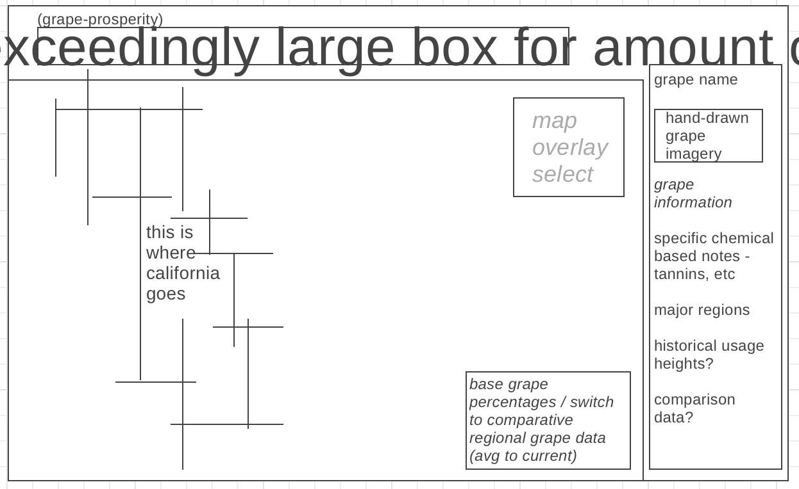

# *~**grape-prosperity**~*

Winemaking is a relatively complex science. Over the last thousands of 
years, many factors have drove certain grapes to be grown in specific regions,
either due to social - or environmental - pressure.  What I would like to do
within this JS Data Visualization, is take as many of these factors and
create a searchable API where you can visual the different  environmental
influences on grapes (and winemaking) across California.

Within this Data visualization I provide searchable functions where you can
specify how different environmental factors help certain grapes thrive within
different climates and regions. These statistics include, but are not limited to,
rainfall, soil-type, temperature range, elevation, and daily cloud cover (sunlight).
This information can hopefully provide insight regional patterns on areas
where specific grape varietals thrive

In the future I would love to implement other tradition influences on wine-making
as a searchable function (amphora usage, kvevri fermentation, as well as
amaro, aromatized high sugar content wines) within the tags for more historical patterns.

## *functionality & mvp-s:*

*~**grape-prosperity**~* provides a way to visualize the complex
field of what goes into the decisions that go into what grape
is well suited to grow within a specific region.

### .grapes.
* have access to the types of grapes shown visually on the map. GP provides interactivity ontop of map overlays to visualize where certain grapes thrive, searchable through a hand-harvested database.

* provide historical context for these grapes, give pertentant and interesting information so that the viewer (no matter knowledge level on grapes) can find this either intellectually, or at least aesthetically, appealing.
* starting with an initial focus on california natural wine makers, I intend to extend this interest to the wider interests globally. Natural wine makers tend to focus on varietals that can naturally withstand the environment and thrive within their given environment, having to produce a wine without the consistency of chemical additives and pesticide help.

### .map.
* interactive map of california (FIGURE OUT API) where average seasonal information is provided as an overlay, switchable through a key in the top right corner of the box.

### .information.
* use APIs to fetch information such as soil-type, annual rainfail, cloud cover, temperature ranges, and more to interact and see what helps make specific grapes thrive in each region.

### .addition project details.
* a thorough introduction to the base knowledge to know what you're currently interacting with!
* this lovely README

## *wireframe:*

* current (initial) mockup for the interface of this project - will likely change as I familiarize myself with css and get a styling that I feel is appropriate. Would love to pull from traditional book ideals and heady research papers.

## .technology, library, api-s.

## .implementation timeline.
* Friday / weekend : 
   continue to research API's and librarys for data visualizations to create a cohesive feeling aesthetic - you can only work with what you have.

* Monday : 
   get backend completely working, have the base down in terms of interactivity of the page, event listeners and hopefully posts/gets.

* Tuesday :
   work through the kinks of the map and the overlays, make sure that the visualizations can switch seamlessly between modes without kinks.

* Wednesday :
   implementation of the visuals and cleaning up the interface of the project. make sure things feel cohesive and spacing exists where it should and should not.

* Thursday :
   bugfix and relax - wear a cute outfit and wave at the fans

* Friday :
   but for real finish up anything needed today and yesterday - plan out later interactivity and make sure that the project feels scalable to Europe.